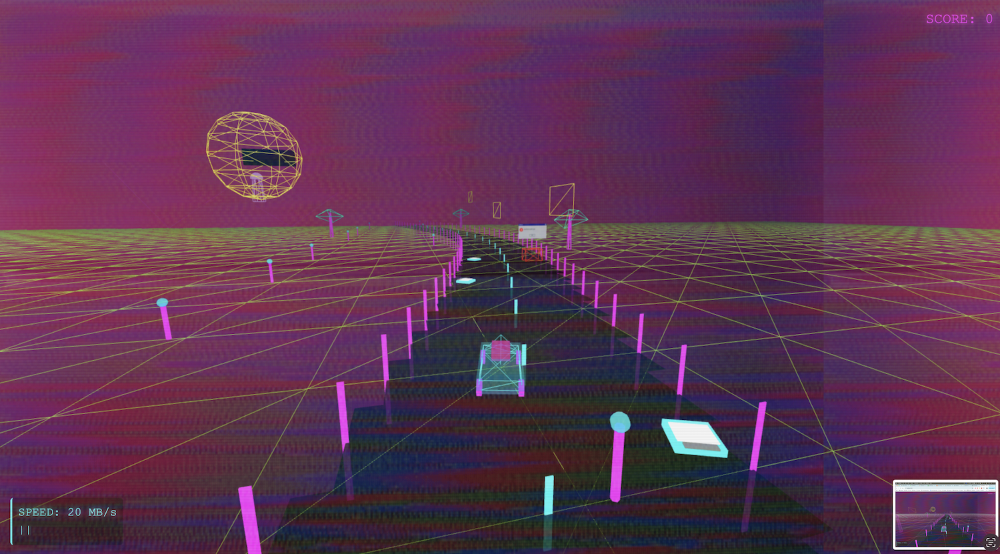

# NEON DRIFT PROTOCOL

A vaporwave racing game with retro aesthetics, featuring endless procedurally generated tracks, glitch effects, and synthwave music.



## About the Game

Navigate through a neon-lit digital highway in this 80s/90s inspired racing game. Collect data fragments to increase your score and speed, while avoiding corrupted data blocks that will slow you down.

## How to Play

### Option 1: Running Locally (with Node.js)

If you have Node.js installed:

1. Clone or download this repository
2. Open a terminal/command prompt in the game directory
3. Install dependencies (if needed):
   ```
   npm install
   ```
4. Start the game:
   ```
   npm start
   ```
5. Open your browser and navigate to:
   ```
   http://localhost:3000
   ```

### Option 2: Running Locally (without Node.js)

If you don't have Node.js installed, you can use any static file server:

#### Using Python (most computers have Python installed)

1. Clone or download this repository
2. Open a terminal/command prompt in the game directory
3. Start a simple HTTP server:

   **For Python 3:**
   ```
   python -m http.server 8000
   ```
   
   **For Python 2:**
   ```
   python -m SimpleHTTPServer 8000
   ```

4. Open your browser and navigate to:
   ```
   http://localhost:8000
   ```

#### Using Visual Studio Code

1. Install the "Live Server" extension
2. Open the project folder in VS Code
3. Right-click on `index.html` and select "Open with Live Server"
4. The game will automatically open in your default browser

#### Using any modern browser

Modern browsers can directly open HTML files, but some features might be limited due to security restrictions:

1. Clone or download this repository
2. Find the `index.html` file in the game directory
3. Double-click the file to open it in your browser
4. If audio or other features don't work, try one of the server methods above

### Option 3: Use a Local Web Server

You can use applications like XAMPP, WAMP, or MAMP to serve the files locally.

## Controls

- **Up Arrow / W**: Accelerate
- **Down Arrow / S**: Brake/Reverse (hold to brake, continue holding to reverse)
- **Left Arrow / A**: Turn left
- **Right Arrow / D**: Turn right
- **Spacebar**: Emergency Brake (dramatically fast stopping)
- **Space**: Start game (on title screen)

## Features

- Procedurally generated endless racing
- Vaporwave/Outrun aesthetic with neon grids and retro elements
- Glitchy VHS effects
- Windows 95-style error messages as obstacles
- Synthwave soundtrack (dont get too excited)
- Dynamic lighting and shader effects
- Drift physics for a fun arcade feel

## Development

Built with:
- Three.js for 3D rendering
- Web Audio API for sound synthesis
- HTML5/CSS3/JavaScript (no external dependencies or frameworks)

## Troubleshooting

- **Game is too slow**: The game is designed to run on modern browsers. Try closing other applications or tabs.
- **No sound**: Make sure your browser allows audio autoplay or press any key to start the game.
- **Controls not working**: Click on the game window to ensure it has focus.
- **Black screen**: Ensure your browser supports WebGL (most modern browsers do).

## Credits

- Developed by Sam for an AI hackathon
- Inspired by vaporwave aesthetics and 80s/90s digital culture
- Sound design inspired by synthwave/vaporwave artists

## License

[MIT License](LICENSE)